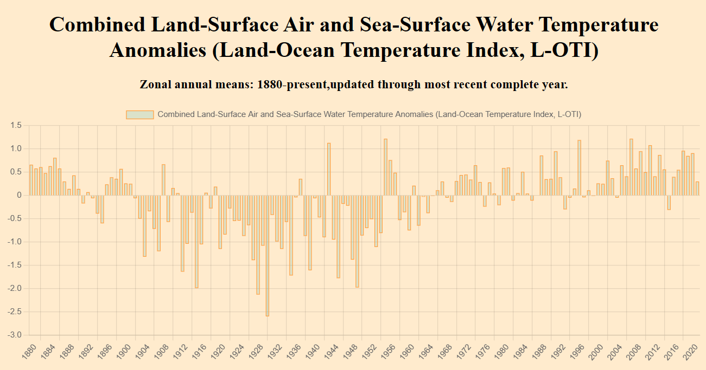
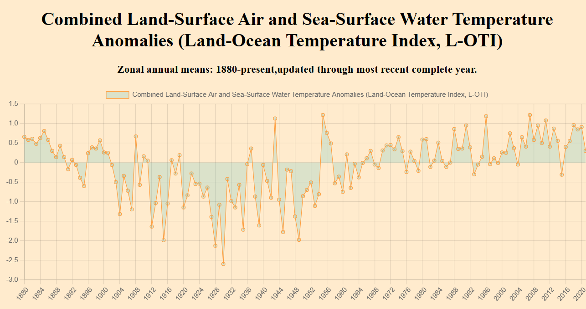

# ChartData
This program charts your data( parsed from a csv file ) in graphical format using the cartesian co-ordinates ( x-axis , y-axis ) to help for easier analysis.

Note: A test file has already been created for you in the *public/csvFiles/ZonAnn.Ts+dSST (1).csv* to test out the program.

## Installing the project
1. Clone the repository to your local machine by running the command, `git clone https://github.com/malachi43/chart-your-data.git` in your CLI (terminal). For this command to work you must have git installed. To download click [here](https://git-scm.com/downloads).

2. After cloning the repository to your local machine this should take you to the root directory/folder ( *chartData/*  ).

3. Run the command `npm install` in your terminal to install the required dependency ( *express* in this case ).

4. Run the command `node server.js` and go to your browser and enter the url *http://localhost:3000*.

# Using the ChartData Program
1. cd into public/index.js ( you can delete the options object and csvFile variable, they are just for illustrations).

2. create an options object similar to the one seen below.

```
const options = { 
    valueForX: 1,
    valueForY: 15,
    header: `Combined Land-Surface Air and Sea-Surface Water Temperature Anomalies (Land-Ocean Temperature Index, L-OTI)`,
    subHeader: `Zonal annual means: 1880-present,updated through most recent complete year.`,
}
```
* valueForX = this should correspond to the column you want to use as the x-axis.
* valueForY = this should correspond to the column you want to use as the y-axis.
* header = value to be used as the graph heading.
* subHeader = value to be used as the graph sub-heading.


3. Create a variable to hold the file path to the csv file you want to analyze. An example is shown below.

```
e.g const csvFile = "./csvFiles/ZonAnn.Ts+dSST (1).csv"

```
4. Pass the **options** object as the first argument and the **csvFile** variable as the second argument to the `parseCsv()` function.
 
### Customization
* Change the **type** property on line 18 to **bar** if you want a BAR CHART GRAPH.

```
 const myChart = new Chart(ctx, {
        line 18  type: 'bar',
        ...
        }
```

### BAR GRAPH


* Change the **type** property on line 18 to **line** if you want a LINE GRAPH.
```
 const myChart = new Chart(ctx, {
        line 18  type: 'line',
        ...
        }
```

### LINE GRAPH

* **backgroundColor**, **borderColor** and **borderWidth** on the **data** property can be customized as well to meet your needs.

```
data: {
        labels: graphX,
        datasets: [{
                    label: subHeading ,
                    data: graphY,
                    backgroundColor: 'rgba(75, 192, 192, 0.2)',
                        
                    borderColor: 'rgba(255, 159, 64, 1)',
                        
                    borderWidth: 1
                }]
            }
            ...
            }

```

chart📈 that data.
